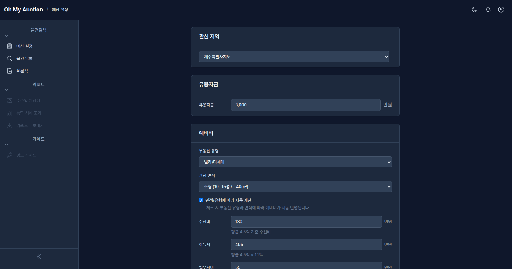
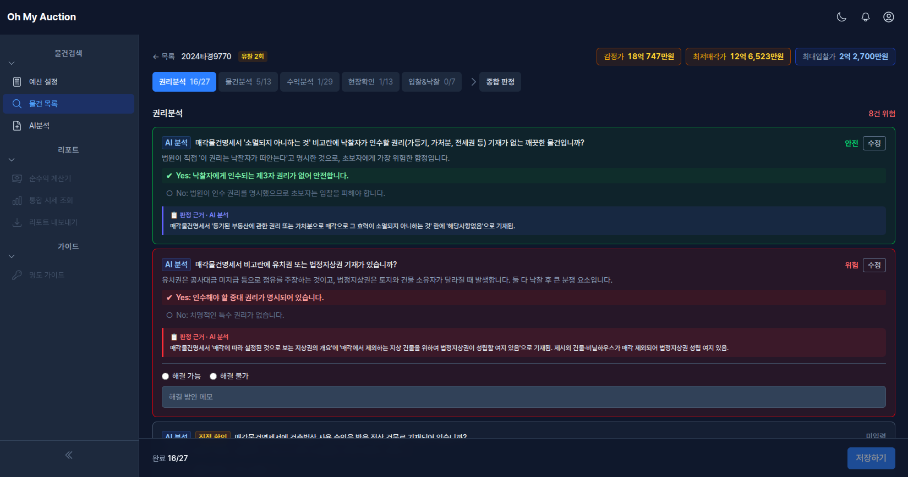

# 부동산 경매 서비스

한국 부동산 경매 초심자를 위한 웹 서비스입니다. 예산 설정부터 물건 분석까지, PDF 문서 기반 AI 자동 분석과 체계적인 점검항목으로 안전한 입찰 판단을 돕습니다. 실행(대출, 세금, 명도)은 분석 리포트를 가지고 오프라인 전문가와 상담하는 구조입니다.

## 프로젝트 제작 취지

> IT 경력은 30년이 훌쩍 넘었지만, 경매는 생소하여 직접 경매 공부를 하면서 도움을 받고자 만들었습니다.  
> 권리 분석부터 입찰까지 프로세스를 몸에 익히면 편하다지만 처음에는 너무 어렵습니다.  
> 그래서 본인을 포함하여 초심자가 쉽게 접근할 수 있도록 도와주는 서비스를 만들었습니다.  
> 개발 과정은 별도 SNS에 기록 중입니다.  
> MVP 단계가 완료되어, 실제로 사용해 보면서 경험도 같이 기록할 예정입니다.  

## 이 서비스가 하는 일

한국의 부동산 경매는 시세보다 저렴하게 물건을 취득할 수 있지만, 초심자에게는 높은 진입 장벽이 있습니다 — 복잡한 권리 분석, 숨겨진 세금 비용, 대출 불확실성, 명도에 대한 두려움. 이 서비스는 자동화와 구조화된 가이드를 통해 이러한 장벽을 제거합니다.

## 사용 가이드

### Step 1. 예산 설정

사이드바의 **예산 설정** 메뉴에서 3단계로 입찰 가능 최대 금액을 산출합니다.

1. **관심 지역 & 유용자금** — 투자 가능한 현금과 관심 지역을 입력합니다
2. **예비비 계산** — 부동산 유형과 면적을 선택하면 수선비, 취득세, 법무사비 등 예비비가 자동 계산됩니다
3. **대출 설정** — 부동산 유형별 대출 정책(1금융/2금융)과 LTV 슬라이더로 최종 입찰 가능 최대 금액을 확인합니다. 서울특별시 등 규제지역은 2026.05 정부 대책에 따른 규제 LTV가 자동으로 적용됩니다



### Step 2. 물건 검색 & 등록

물건 등록 흐름은 두 개의 사이드바 메뉴로 분리되어 있습니다.

- **물건 목록** — 검색 전용 페이지
  - **사건번호 직접 추가** — 법원 + 사건번호(예: 2024타경12345)로 한 줄 폼에서 즉시 등록
  - **조건 검색** — Step 1에서 설정한 지역과 예산 기준으로 법원경매 사이트를 검색합니다(최저매각가 기준). 결과는 페이지당 8건씩, 최대 20건까지 노출됩니다
- **내 물건** — 저장된 관심 물건 관리 페이지
  - 카드에는 법원 이름(🏛️), 주소, 최저매각가가 함께 표시됩니다
  - 별 아이콘으로 **즐겨찾기**를 토글하면 다음 페이지 로드부터 상단 우선 정렬됩니다
  - 안전등급(안전/주의/위험)으로 필터링할 수 있습니다
  - 예산 초과 여부는 **최저매각가**(감정가가 아님)와 입찰 가능 최대 금액을 비교해 표시됩니다


### Step 3. AI 분석 (PDF 업로드)

**AI 분석** 메뉴에서 물건의 PDF 문서를 AI로 분석합니다. PDF는 파일당 최대 5MB까지 업로드 가능합니다.

- **AI 자동분석** — 매각물건명세서·현황조사서·감정평가서·등기부등본 PDF를 업로드하면 시스템이 외부 LLM API를 호출해 자동 분석합니다. *현재는 외부 LLM API 과금 부담으로 임시 중단된 상태이며, 구독 모델 도입 후 재개 예정입니다.*
- **AI 수동분석** — 제공되는 프롬프트를 복사하여 ChatGPT/Claude/Gemini에서 직접 분석한 뒤, 결과 JSON을 파일 업로드 또는 붙여넣기로 입력합니다(현재 권장 경로)

분석이 완료되면 약 30~35개 항목이 자동으로 채워집니다.


### Step 4. 점검항목 확인 (5탭)

물건 상세 페이지에서 AI가 채운 89개 점검항목을 5개 탭으로 나누어 확인합니다.

| 탭 | 항목 수 | 내용 |
|---|---|---|
| 권리분석 | 27개 | 소유권, 근저당, 임차인, 선순위 권리 등 |
| 물건분석 | 13개 | 건물 상태, 용도지역, 위반건축물 등 |
| 현장확인 | 13개 | 실제 점유자, 주변 환경, 접근성 등 |
| 수익분석 | 29개 | 시세, 임대수익, 대출 가능성 등 |
| 입찰&낙찰 | 7개 | 입찰가 산정, 경쟁 분석, 최종 의견 |

각 항목에서 위험 여부(예/아니오)를 확인하고, 필요시 메모를 추가합니다.



### Step 5. 최종등급 & 리포트

모든 탭의 점검이 완료되면 **최종등급** 탭에서 종합 안전등급을 확인합니다.

- **종합 등급** — 안전 / 주의 / 위험 / 미완료 중 하나로 판정
- **입찰 의견** — AI 분석 결과와 예산을 종합한 의견
- **위험 항목 요약** — 주의가 필요한 항목을 한눈에 확인
- **PDF 다운로드** — 분석 결과를 PDF 리포트로 내보내어 오프라인 전문가(법무사, 세무사, 은행) 상담 시 활용

### Step 6. 명도 가이드 & 시뮬레이터

낙찰 후 가장 어려운 단계인 **명도**(점유자 퇴거)에 대한 가이드를 제공합니다. 사이드바의 **명도 가이드** 메뉴 안에서 가이드와 시뮬레이터를 모두 이용할 수 있습니다.

- **명도 가이드** — 15단계 + 9개 분기로 구성된 명도 프로세스를 단계별로 설명합니다. 각 단계에는 법률 근거가 포함되어 있습니다
- **명도 시뮬레이터** — 33개 질문에 예/아니오로 답하면 해당 물건의 명도 난이도와 예상 소요 기간을 알려줍니다. 진입 화면에서 **내 물건으로 시뮬레이션**(AI 분석 데이터 자동 반영) 또는 **직접 입력으로 시뮬레이션**을 탭으로 선택하며, 이후 모든 화면 상단에 현재 모드 배지가 표시됩니다

> 명도 실행은 반드시 오프라인 전문가(법무사)와 상담하세요. 이 가이드는 사전 이해를 돕기 위한 것입니다.

## 설계 원칙

- **반복 숙달 유도** — 한 건 분석 후 끝이 아니라, 다음 물건으로 자연스럽게 이어지는 사이클
- **과신 방지** — AI 리포트는 사용자가 업로드한 원본 문서(PDF)를 근거로 생성하며, 원문과 함께 표시
- **현장 존중** — 온라인 기능은 사전 스크리닝 전용. 최종 판단은 현장 임장에서

## 기술 스택

- **프레임워크**: Ruby on Rails 8.1 (Ruby 3.4.8)
- **프론트엔드**: Hotwire (Turbo + Stimulus), TailwindCSS, ViewComponent
- **데이터베이스**: SQLite + Solid Cache / Queue / Cable
- **에셋 파이프라인**: Propshaft + ImportMap (Node.js 불필요)
- **배포**: Docker + Kamal + Thruster

## 시작하기

```bash
bin/setup        # 의존성 설치 및 데이터베이스 준비
bin/dev          # 개발 서버 실행 (Puma + CSS/JS 감시)
bin/rails test   # 테스트 실행
bin/ci           # 전체 CI 파이프라인 (셋업, 린트, 보안, 테스트, 시드 확인)
```

## OAuth Developer Setup

각 개발자는 직접 OAuth 앱을 생성해야 합니다. 자격증명은
`config/credentials/development.yml.enc` 에 다음 키로 저장하세요:

```yaml
google:
  client_id: "..."
  client_secret: "..."
naver:
  client_id: "..."
  client_secret: "..."
kakao:
  client_id: "..."
  client_secret: "..."
```

### Google
1. https://console.cloud.google.com → APIs & Services → Credentials → Web application
2. Authorized redirect URI: `http://localhost:3000/auth/google_oauth2/callback`
3. Scopes: `userinfo.email`, `userinfo.profile`

### Naver
1. https://developers.naver.com → Application 등록
2. Service URL: `http://localhost:3000`
3. Callback URL: `http://localhost:3000/auth/naver/callback`
4. 제공 정보: 이메일 주소, 별명, 프로필 사진

### Kakao
1. https://developers.kakao.com → Application 생성
2. 보안 → Client Secret 생성
3. 카카오 로그인 → 활성화 ON
4. Redirect URI: `http://localhost:3000/auth/kakao/callback`
5. 동의항목: **카카오계정(이메일) — 필수 동의**, **프로필 정보(닉네임)**, **프로필 사진**

## 문서

- [SRS v2.2](docs/superpowers/specs/2026-04-11-srs-v2-design.md) — 전체 요구사항 정의서 (F01~F03, F05~F06, 코드베이스 감사 반영)
- [SRS v1.0](docs/superpowers/specs/2026-04-05-srs-design.md) — 원본 요구사항 정의서 (F01~F11, 참고용)
- [개발 표준](docs/standards/) — 규칙, 기술 스택, 도구, 품질 기준
- [CLAUDE.md](CLAUDE.md) — AI 어시스턴트 가이드라인
