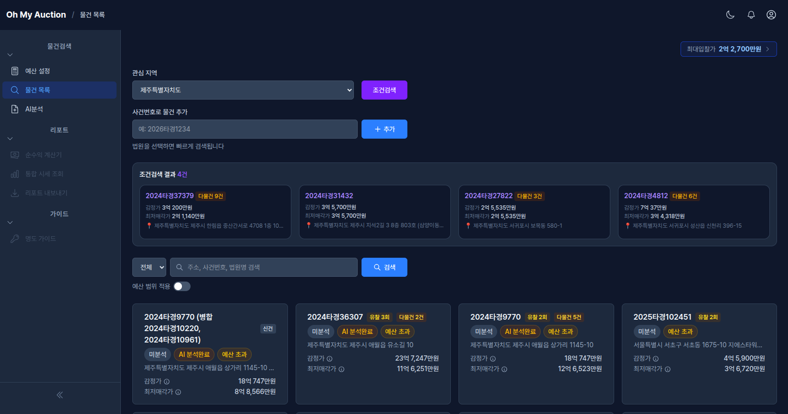
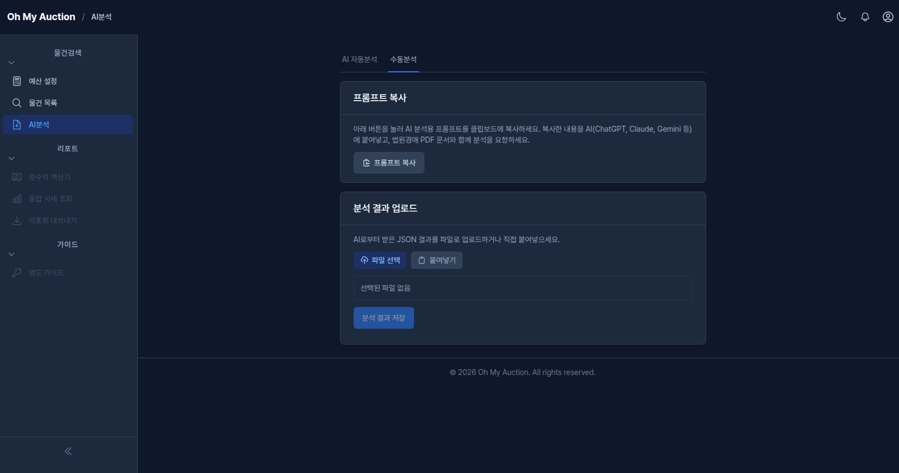

# 부동산 경매 서비스

한국 부동산 경매 초심자를 위한 웹 서비스입니다. 예산 설정부터 물건 분석까지, PDF 문서 기반 AI 자동 분석과 체계적인 점검항목으로 안전한 입찰 판단을 돕습니다. 실행(대출, 세금, 명도)은 분석 리포트를 가지고 오프라인 전문가와 상담하는 구조입니다.

## 프로젝트 제작 취지

> IT 경력은 30년이 훌쩍 넘었지만, 경매는 생소하여 직접 경매 공부를 하면서 도움을 받고자 만들고 있습니다.  
> 권리 분석부터 입찰까지 프로세스를 몸에 익히면 편하다지만 처음에는 너무 어렵습니다.  
> 그래서 본 인을 포함하여 초심자가 쉽게 접근할 수 있도록 도와주는 서비스를 만들고자 합니다.  
> 개발 과정은 별도 SNS에 기록할 예정입니다.    
> 서비스를 임시로 올릴 호스팅 업체도 찾고 있습니다. 카페24가 가장 저렴할 듯 합니다.  
> 추후 프로젝트가 완성되면 실제로 사용해보면서 경험도 같이 기록할 예정입니다.  

## 이 서비스가 하는 일

한국의 부동산 경매는 시세보다 저렴하게 물건을 취득할 수 있지만, 초심자에게는 높은 진입 장벽이 있습니다 — 복잡한 권리 분석, 숨겨진 세금 비용, 대출 불확실성, 명도에 대한 두려움. 이 서비스는 자동화와 구조화된 가이드를 통해 이러한 장벽을 제거합니다.

## 스크린샷

### 예산설정


### 물건목록


### AI분석


### 권리분석


### 핵심 기능 (MVP — P0)

| 기능 | 설명 | 진행사항 |
|---|---|---|
| **F01. 온보딩 예산 설정** | 3단계 질문으로 보유 현금, 예비비, 대출 비율을 기반으로 입찰 가능 최대 금액을 산출합니다. 예비비 기본값은 시드 데이터(JSON) 기준. 물건 유형은 온보딩에서 선택하지 않음. | 완료 |
| **F02. 물건분석 (5탭+최종등급)** | PDF 업로드 → AI(LLM) 자동 분석(권리분석·물건분석 약 30~35개 항목) + 국토부 실거래가 API 자동화(4개 항목) + 수동 입력. 89개 점검항목을 5개 탭(권리분석 27, 물건분석 13, 현장확인 13, 수익분석 29, 입찰&낙찰 7)으로 분류. 최종등급 탭에서 종합 안전등급 산출. | 진행중 |

### 확장 기능 (P1)

| 기능 | 설명 |
|---|---|
| **F03. 순수익 계산기** | 모든 세금과 비용을 차감한 실제 순수익을 계산합니다. 역산 모드(목표 수익 → 최대 입찰가). 세금 계산 복잡도가 높아 P1으로 이동. |
| **F04. 통합 시세 조회** | 실거래가, 호가, 급매가를 한 화면에서 비교하며, 괴리율 경고로 호가를 시세로 착각하여 비싸게 입찰하는 실수를 방지합니다. MVP의 국토부 API 인프라 위에 구축. |
| **F05. 분석 리포트 PDF 내보내기** | 물건 분석 결과를 오프라인 전문가 상담용 PDF로 내보냅니다. 전문가 상담 가이드(법무사/세무사/은행/대출 컨설턴트) 포함. |

### 성장 기능 (P2)

| 기능 | 설명 |
|---|---|
| **F06. 명도 시나리오 가이드** | 명도 프로세스 단계별 설명, 분석 결과 기반 시나리오 매칭, 미확인 항목 알림. 실행은 오프라인 전문가 상담으로. |

## 설계 원칙

- **반복 숙달 유도** — 한 건 분석 후 끝이 아니라, 다음 물건으로 자연스럽게 이어지는 사이클
- **과신 방지** — AI 리포트는 사용자가 업로드한 원본 문서(PDF)를 근거로 생성하며, 원문과 함께 표시
- **현장 존중** — 온라인 기능은 사전 스크리닝 전용. 최종 판단은 현장 임장에서

## 기술 스택

- **프레임워크**: Ruby on Rails 8.1 (Ruby 3.4.8)
- **프론트엔드**: Hotwire (Turbo + Stimulus), TailwindCSS, ViewComponent
- **데이터베이스**: SQLite + Solid Cache / Queue / Cable
- **에셋 파이프라인**: Propshaft + ImportMap (Node.js 불필요)
- **배포**: Docker + Kamal + Thruster

## 시작하기

```bash
bin/setup        # 의존성 설치 및 데이터베이스 준비
bin/dev          # 개발 서버 실행 (Puma + CSS/JS 감시)
bin/rails test   # 테스트 실행
bin/ci           # 전체 CI 파이프라인 (셋업, 린트, 보안, 테스트, 시드 확인)
```

## 문서

- [SRS v2.0](docs/superpowers/specs/2026-04-11-srs-v2-design.md) — 전체 요구사항 정의서 (F01~F06, 최신)
- [SRS v1.0](docs/superpowers/specs/2026-04-05-srs-design.md) — 원본 요구사항 정의서 (F01~F11, 참고용)
- [PDF 기반 분석 재설계](docs/superpowers/specs/2026-04-11-pdf-analysis-redesign.md) — F02 물건분석을 PDF 업로드 + LLM 멀티모달 분석으로 전환
- [STANDARDS.md](STANDARDS.md) — 개발 표준 및 아키텍처 패턴
- [CLAUDE.md](CLAUDE.md) — AI 어시스턴트 가이드라인
