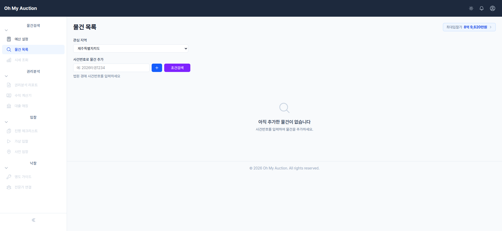
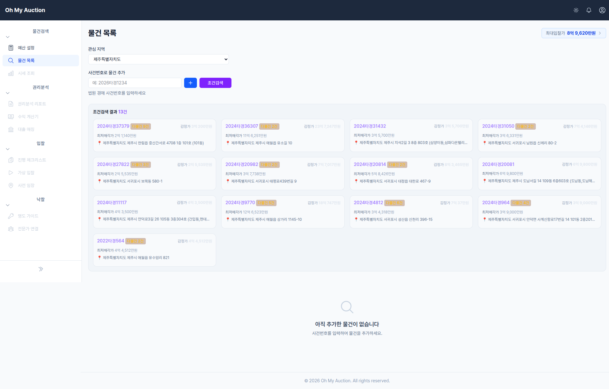

# 부동산 경매 서비스

한국 부동산 경매 초심자를 위한 웹 서비스입니다. 예산 설정부터 입찰까지 경매 전 과정을 자동화된 위험 분석, 수익 계산, 단계별 체크리스트로 안내합니다.

## 프로젝트 제작 취지

> IT 경력은 30년이 훌쩍 넘었지만, 경매는 생소하여 직접 경매 공부를 하면서 도움을 받고자 만들고 있습니다.  
> 권리 분석부터 입찰까지 프로세스를 몸에 익히면 편하다지만 처음에는 너무 어렵습니다.  
> 그래서 본 인을 포함하여 초심자가 쉽게 접근할 수 있도록 도와주는 서비스를 만들고자 합니다.  
> 개발 과정은 별도 SNS에 기록할 예정입니다.    
> 서비스를 임시로 올릴 호스팅 업체도 찾고 있습니다. 카페24가 가장 저렴할 듯 합니다.  
> 추후 프로젝트가 완성되면 실제로 사용해보면서 경험도 같이 기록할 예정입니다.  

## 이 서비스가 하는 일

한국의 부동산 경매는 시세보다 저렴하게 물건을 취득할 수 있지만, 초심자에게는 높은 진입 장벽이 있습니다 — 복잡한 권리 분석, 숨겨진 세금 비용, 대출 불확실성, 명도에 대한 두려움. 이 서비스는 자동화와 구조화된 가이드를 통해 이러한 장벽을 제거합니다.

## 스크린샷

| 물건 목록 | 조건검색 결과 |
|---|---|
|  |  |

### 핵심 기능 (MVP — P0)

| 기능 | 설명 | 진행사항 |
|---|---|---|
| **F01. 온보딩 예산 설정** | 3단계 질문으로 보유 현금, 예비비, 대출 비율을 기반으로 입찰 가능 최대 금액을 산출합니다. 관심 지역 설정도 포함됩니다. | 완료 |
| **F02. 물건 수집** | **조건검색**으로 관심 지역과 예산 범위에 맞는 경매 물건을 일괄 검색하여 인라인으로 표시하고, 클릭 한 번으로 내 목록에 추가합니다. | 완료 |
| **F03. 물건분석** | 사용자가 법원경매 사이트에서 확보한 PDF 문서(매각물건명세서, 현황조사서, 감정평가서, 등기부등본 등)를 업로드하면 AI(LLM)가 문서를 직접 분석하여 79개 점검항목을 자동 판정합니다. 물건 카드에서 문서 추가 후 분석하거나, 메뉴에서 바로 PDF만 업로드하여 독립 분석도 가능합니다. 6개 LLM 제공자 지원(Anthropic, OpenAI, Gemini, OpenRouter, Ollama, Mock). | 진행중 |
| **F04. 순수익 계산기** | 모든 세금과 비용을 차감한 실제 순수익을 계산합니다. 역산 모드: 목표 수익을 입력하면 최대 입찰가를 산출합니다. 개인 vs 매매사업자 세율 비교를 나란히 표시합니다. | 대기 |

### 확장 기능 (P1)

| 기능 | 설명 |
|---|---|
| **F05. 통합 시세 조회** | 실거래가, 호가, 급매가를 한 화면에서 비교하며, 괴리율 경고로 호가를 시세로 착각하여 비싸게 입찰하는 실수를 방지합니다. |
| **F06. 대출 사전 매칭** | 경락잔금대출 가능 여부를 사전 확인하고, 제휴 상담사로부터 조건을 비교합니다. |

### 성장 기능 (P2–P3)

| 기능 | 설명 |
|---|---|
| **F07. 명도 시나리오 가이드** | 상황별 명도 대응 시나리오와 법적 서류(내용증명, 인도명령 등)를 자동 생성합니다. |
| **F08. 전문가 멘토링 연결** | 검증된 전문가에게 AI 분석 결과에 대한 1:1 유료 피드백을 받을 수 있는 마켓플레이스입니다. |

## 설계 원칙

- **반복 숙달 유도** — 한 건 분석 후 끝이 아니라, 다음 물건으로 자연스럽게 이어지는 사이클
- **과신 방지** — AI 리포트는 사용자가 업로드한 원본 문서(PDF)를 근거로 생성하며, 원문과 함께 표시
- **현장 존중** — 온라인 기능은 사전 스크리닝 전용. 최종 판단은 현장 임장에서

## 기술 스택

- **프레임워크**: Ruby on Rails 8.1 (Ruby 3.4.8)
- **프론트엔드**: Hotwire (Turbo + Stimulus), TailwindCSS, ViewComponent
- **데이터베이스**: SQLite + Solid Cache / Queue / Cable
- **에셋 파이프라인**: Propshaft + ImportMap (Node.js 불필요)
- **배포**: Docker + Kamal + Thruster

## 시작하기

```bash
bin/setup        # 의존성 설치 및 데이터베이스 준비
bin/dev          # 개발 서버 실행 (Puma + CSS/JS 감시)
bin/rails test   # 테스트 실행
bin/ci           # 전체 CI 파이프라인 (셋업, 린트, 보안, 테스트, 시드 확인)
```

## 문서

- [SRS v1.0](docs/superpowers/specs/2026-04-05-srs-design.md) — 전체 요구사항 정의서 (F01~F11 원본)
- [기능 개편 스펙](docs/superpowers/specs/2026-04-07-feature-restructure-design.md) — F02+F03 통합, 11개→7개 기능 재구성
- [PDF 기반 분석 재설계](docs/superpowers/specs/2026-04-11-pdf-analysis-redesign.md) — F03 물건분석을 PDF 업로드 + LLM 멀티모달 분석으로 전환
- [STANDARDS.md](STANDARDS.md) — 개발 표준 및 아키텍처 패턴
- [CLAUDE.md](CLAUDE.md) — AI 어시스턴트 가이드라인
